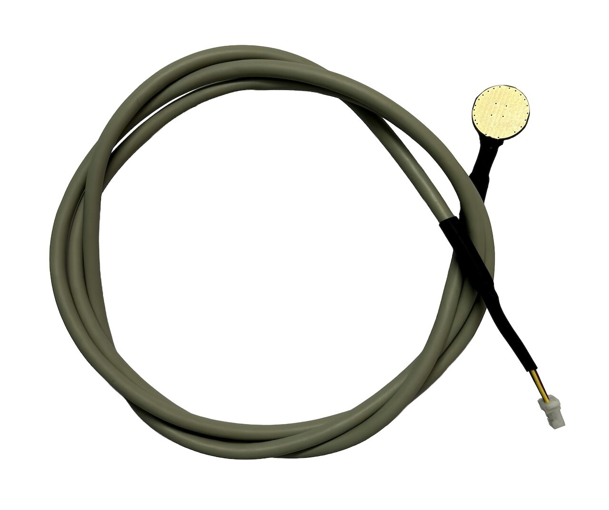

# ProtoCentral AS6221 Arduino Library

[](https://github.com/Protocentral/protocentral_as6221_arduino/actions?workflow=Compile+Examples)

Arduino library for the [ProtoCentral AS6221 Wearable Body Temperature Sensor (QWIIC)](https://protocentral.com/), based on the [ams OSRAM AS6221](https://ams-osram.com/products/sensors/temperature-sensors/ams-as6221-temperature-sensor) factory-calibrated digital temperature sensor.

## Don't have one? [Buy it here](https://protocentral.com/product/protocentral-as6221-wearable-body-temperature-sensor-qwiic/)



## Features

- **±0.09 °C accuracy** across the 20 °C – 42 °C body-temperature band
- **16-bit** resolution (1 LSB = 0.0078125 °C)
- Factory-calibrated — no calibration required
- Wide **1.7 V – 3.6 V** supply, accuracy held across the full range
- Low power: ~6 µA typical operating current (4 Hz)
- Standard I²C 2-wire interface, **8 selectable addresses** (0x48 – 0x4F)
- Reads temperature in Celsius or Fahrenheit
- QWIIC / STEMMA QT compatible
- Works on any board with `Wire` (AVR, SAMD, ESP32, ESP8266, RP2040, STM32, and more)

## Installation

### Arduino Library Manager (Recommended)
1. Open the Arduino IDE
2. Go to **Sketch → Include Library → Manage Libraries**
3. Search for "ProtoCentral AS6221"
4. Click **Install**

### Manual Installation
1. Download or clone this repository
2. Copy it into your Arduino libraries folder (`~/Documents/Arduino/libraries/`)

## Hardware Setup

Plug the board into a QWIIC / STEMMA QT port, or wire it directly:

| AS6221 pin | Arduino connection | Pin function |
|------------|--------------------|--------------|
| 3V3 | 3.3V | Power supply (1.7 V – 3.6 V) |
| GND | GND | Ground |
| SDA | A4 (or the board's SDA pin) | Serial data |
| SCL | A5 (or the board's SCL pin) | Serial clock |

## Quick Start

```cpp
#include <Wire.h>
#include "protocentral_as6221.h"

ProtocentralAS6221 tempSensor;  // default address 0x48

void setup() {
  Serial.begin(115200);
  if (!tempSensor.begin()) {
    Serial.println("AS6221 not found!");
    while (1);
  }
}

void loop() {
  Serial.println(tempSensor.readTemperatureC(), 4);
  delay(1000);
}
```

### Using a custom I2C bus or address

The AS6221 supports 8 addresses (0x48–0x4F) selected by the ADD0/ADD1 pins, so up to eight sensors can share one bus. Pass the address to the constructor, and the bus to `begin()`:

```cpp
ProtocentralAS6221 tempSensor(0x49);   // alternate address

tempSensor.begin(Wire1);               // start on the Wire1 bus
```

## API Reference

### Constructor

```cpp
ProtocentralAS6221(uint8_t address = AS6221_DEFAULT_ADDRESS)
```

### Methods

| Method | Description |
|--------|-------------|
| `begin(wirePort = Wire)` | Start I²C and confirm the sensor responds; returns `true` on success |
| `readTemperatureC()` | Read the body temperature in degrees Celsius |
| `readTemperatureF()` | Read the body temperature in degrees Fahrenheit |
| `readConfig()` | Read the 16-bit configuration register |
| `writeConfig(value)` | Write the 16-bit configuration register |

### Constants

| Constant | Value | Description |
|----------|-------|-------------|
| `AS6221_DEFAULT_ADDRESS` | `0x48` | Default I2C address (range 0x48 – 0x4F) |
| `AS6221_LSB_C` | `0.0078125` | Degrees Celsius per LSB |

## Examples

| Example | Description |
|---------|-------------|
| `01-basic-temperature-reading` | Print temperature in Celsius and Fahrenheit to the Serial Monitor |
| `02-temperature-serial-plotter` | Stream temperature to the Arduino Serial Plotter |

## Related

- **Hardware (KiCad, CERN-OHL-P v2):** https://github.com/Protocentral/protocentral_as6221_hardware
- **MicroPython library:** https://github.com/Protocentral/protocentral_as6221_micropython
- **Datasheet:** [ams OSRAM AS6221](https://look.ams-osram.com/m/37b40772f2d420e0/original/AS6221-Digital-temperature-sensor.pdf)

## License


This product is open source! Both our hardware and software are open source and licensed under the following licenses:

**Hardware:** [Creative Commons Share-alike 4.0 International](http://creativecommons.org/licenses/by-sa/4.0/) 

**Software:** [MIT License](http://opensource.org/licenses/MIT)

**Documentation:** [Creative Commons Share-alike 4.0 International](http://creativecommons.org/licenses/by-sa/4.0/)

See [LICENSE.md](LICENSE.md) for the full license text.
